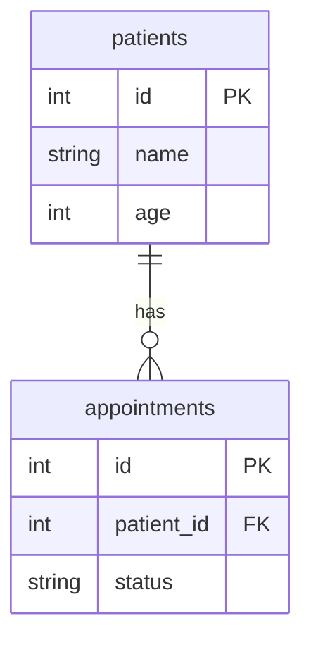

# Clinic Management App

A simple clinic management system built with FastAPI and Streamlit.

## Tech Stack

- FastAPI (backend API)
- Streamlit (frontend/dashboard)
- SQLite
- SQLAlchemy
- Pydantic
- Git + GitHub

## Project Structure
```
clinic/
├── backend/
│   ├── main.py         # FastAPI app and routes
│   ├── models.py       # SQLAlchemy database models
│   ├── schemas.py      # Pydantic request/response schemas
│   ├── database.py     # Database connection and session
│   └── .env            # Environment variables (not committed)
├── frontend/
│   ├── CliniC.py       # Dashboard (entry point)
│   ├── api.py          # API call functions
│   └── pages/
│       ├── 1_Patients.py
│       └── 2_Appointments.py
├── requirements.txt
└── README.md
```
## Features

- **Patient Management** — add, view, search, edit, delete
- **Appointment Management** — create, filter by date/status, mark as complete
- **Dashboard** — live patient count, today's appointments, upcoming list
- **CSV Export** — download all patients as a CSV file
- **Dark Mode** — built into Streamlit, toggle from the settings menu

## Setup

**1. Clone the repository:**

```bash
git clone https://github.com/yourusername/clinic.git
cd clinic
```

**2. Create the `.env` file inside `/backend`:**

DATABASE_URL=sqlite:///./clinic.db

## Running the App

### Option 1 — Docker (Recommended)

Make sure Docker Desktop is running, then from the project root:

```bash
docker-compose up --build
```

Open `http://localhost:8501` in your browser.

To stop:

```bash
docker-compose down
```

### Option 2 — Without Docker

**1. Create and activate virtual environment:**

```bash
python -m venv .venv

# Windows PowerShell
.\.venv\Scripts\Activate.ps1

# Windows Command Prompt
.venv\Scripts\activate

# Mac/Linux
source .venv/bin/activate
```

**2. Install dependencies:**

```bash
cd backend
pip install -r requirements.txt

cd ../frontend
pip install -r requirements.txt
```

**3. Two terminals needed, both with the virtual environment activated:**

Terminal 1 — Backend:
```bash
cd backend
uvicorn main:app --reload
```

Terminal 2 — Frontend:
```bash
cd frontend
streamlit run CliniC.py
```

Open `http://localhost:8501` in your browser.

## API Documentation

FastAPI generates interactive API docs automatically.
Open `http://127.0.0.1:8000/docs` after starting the backend.

### Patients

| Method | Endpoint | Description |
|--------|----------|-------------|
| GET    | `/patients` | Get all patients |
| GET | `/patients?search=name` | Search patients by name |
| POST   | `/patients` | Create a new patient |
| PUT    | `/patients/{id}` | Update a patient |
| DELETE | `/patients/{id}` | Delete a patient |

### Appointments

| Method | Endpoint | Description |
|--------|----------|-------------|
| GET    | `/appointments` | Get all appointments |
| GET    | `/appointments?date=2025-05-15` | Filter by date |
| GET    | `/appointments?status=Scheduled` | Filter by status |
| POST   | `/appointments` | Create a new appointment |
| PUT    | `/appointments/{id}` | Update an appointment |
| DELETE | `/appointments/{id}` | Delete an appointment |

### Example — Create Patient

```json
POST /patients
{
    "name": "Aisha Nair",
    "age": 28,
    "gender": "Female",
    "phone": "9876543210",
    "symptoms": "Fever, headache"
}
```

### Example — Create Appointment

```json
POST /appointments
{
    "patient_id": 1,
    "doctor": "Dr. Mehta",
    "date": "2025-05-15",
    "time": "10:00 AM",
    "status": "Scheduled"
}
```


```markdown
# Technical Architecture

## Overview

CliniC is a three-tier web application. Each tier has a single responsibility and communicates only with the tier directly adjacent to it.

```
[ Streamlit Frontend ] → HTTP requests → [ FastAPI Backend ] → SQLAlchemy → [ SQLite Database ]
```

The frontend never touches the database directly. The database never knows the frontend exists. All communication goes through the API.

---

## Tier 1 — Frontend (Streamlit)

**Location:** `/frontend`

**Responsibility:** Render the UI and handle user interactions.

**Files:**
- `CliniC.py` — entry point, dashboard page
- `pages/1_Patients.py` — patient management UI
- `pages/2_Appointments.py` — appointment management UI
- `api.py` — all HTTP calls to the backend in one place

**How it works:**

Streamlit reruns the entire script top to bottom on every user interaction. `st.session_state` is used to persist UI state between reruns — specifically which patient is being edited or pending deletion.

All communication with the backend goes through `api.py`. Pages never make raw HTTP requests — they call functions like `get_patients()` which internally uses the `requests` library. This means if the backend URL changes, only one file needs updating.

**Port:** 8501

---

## Tier 2 — Backend (FastAPI)

**Location:** `/backend`

**Responsibility:** Exposes the data via a RESTful API, validates requests, enforces business logic.

**Files:**
- `main.py` — FastAPI app, all route definitions
- `database.py` — database engine, session factory, dependency
- `models.py` — SQLAlchemy ORM models (table definitions)
- `schemas.py` — Pydantic schemas (request/response validation)
- `.env` — environment variables (not committed to git)

**How it works:**

Every incoming request goes through this flow:

```
Request arrives
    → Pydantic validates the request body against the schema
    → Route function runs
    → SQLAlchemy session opened via Depends(get_db)
    → Database query executed
    → Result serialized back through Pydantic response schema
    → JSON response sent back
    → Session closed
```

CORS middleware allows the frontend (port 8501) to call the backend (port 8000) without the browser blocking it.

**Port:** 8000

---

## Tier 3 — Database (SQLite + SQLAlchemy)

**Location:** `/backend/clinic.db`

**Responsibility:** Persist data.

**Working:**

SQLAlchemy acts as the ORM — you write Python, it generates SQL. Two tables:

```
patients
    id          INTEGER  PRIMARY KEY
    name        TEXT     NOT NULL
    age         INTEGER
    gender      TEXT
    phone       TEXT
    symptoms    TEXT
    created_at  DATETIME

appointments
    id          INTEGER  PRIMARY KEY
    patient_id  INTEGER  FOREIGN KEY → patients.id
    doctor      TEXT     NOT NULL
    date        DATE     NOT NULL
    time        TEXT     NOT NULL
    status      TEXT     DEFAULT "Scheduled"
    created_at  DATETIME
```

`patient_id` is a foreign key — it links every appointment to a patient. You cannot create an appointment for a patient that doesn't exist. Deleting a patient cascades and deletes all their appointments automatically.

SQLite was chosen for simplicity — it's file-based, requires no server, and ships with Python. In production this would be replaced with PostgreSQL by changing one line in `.env`.

---

## Containerisation (Docker)

Both services run in separate Docker containers managed by `docker-compose.yml`.

```
docker-compose.yml
    ├── backend  (port 8000)
    │       built from /backend/Dockerfile
    │       mounts ./backend/clinic.db for data persistence
    │
    └── frontend (port 8501)
            built from /frontend/Dockerfile
            depends_on: backend
            API_URL=http://backend:8000
```

Inside Docker, services communicate using their service names as hostnames. The frontend calls `http://backend:8000` instead of `http://127.0.0.1:8000`. Outside Docker it falls back to localhost via `os.getenv("API_URL", "http://127.0.0.1:8000")`.

The database file is mounted as a volume so data persists even if containers are stopped or removed.

---

## Data Flow Example — Adding a Patient

```
1. User fills in the Add Patient form in Streamlit
2. User clicks "Add Patient"
3. Streamlit validates the form fields (name, phone, age required)
4. Streamlit calls create_patient() in api.py
5. api.py sends POST /patients with the data as JSON
6. FastAPI receives the request
7. Pydantic validates the request body against PatientCreate schema
8. Route function checks if phone number already exists
9. If not, SQLAlchemy creates a Patient object and commits it to clinic.db
10. Database assigns an id and created_at timestamp
11. SQLAlchemy refreshes the object with the new values
12. FastAPI serializes the response through PatientResponse schema
13. JSON response sent back to api.py
14. api.py returns the response to 1_Patients.py
15. Streamlit checks response.status_code == 200
16. Shows success message and reruns the page
17. Table refreshes showing the new patient
```

---

## Technology Choices

| Technology | Used for |
|------------|-----|
| FastAPI | Automatic validation, auto-generated documents, fast to build |
| Streamlit | Turns Python scripts into web apps with minimal code |
| SQLAlchemy | ORM abstracts the database — swap SQLite for PostgreSQL with one line |
| Pydantic | Automatic request/response validation, clear error messages |
| SQLite | No server needed, file-based, perfect for development |
| Docker | Consistent environment across machines, easy to deploy |
| python-dotenv | Keeps config out of code, easy to change per environment |
```

