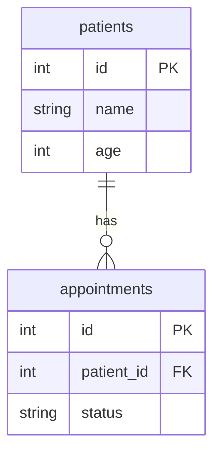
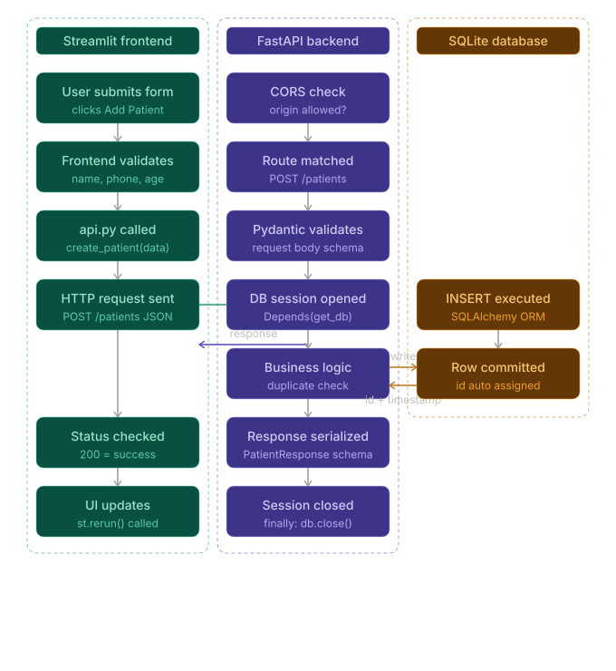

# Clinic Management App

A simple clinic management system built with FastAPI and Streamlit.

## Tech Stack

- FastAPI (backend API)
- Streamlit (frontend/dashboard)
- SQLite
- SQLAlchemy
- Pydantic
- Git + GitHub

## Project Structure
```
clinic/
├── backend/
│   ├── main.py         # FastAPI app and routes
│   ├── models.py       # SQLAlchemy database models
│   ├── schemas.py      # Pydantic request/response schemas
│   ├── database.py     # Database connection and session
│   └── .env            # Environment variables (not committed)
├── frontend/
│   ├── CliniC.py       # Dashboard (entry point)
│   ├── api.py          # API call functions
│   └── pages/
│       ├── 1_Patients.py
│       └── 2_Appointments.py
├── requirements.txt
└── README.md
```
## Features

- **Patient Management** — add, view, search, edit, delete
- **Appointment Management** — create, filter by date/status, mark as complete
- **Dashboard** — live patient count, today's appointments, upcoming list
- **CSV Export** — download all patients as a CSV file
- **Dark Mode** — built into Streamlit, toggle from the settings menu

## Setup

**1. Clone the repository:**

```bash
git clone https://github.com/yourusername/clinic.git
cd clinic
```

**2. Create the `.env` file inside `/backend`:**

DATABASE_URL=sqlite:///./clinic.db

## Running the App

### Option 1 — Docker (Recommended)

Make sure Docker Desktop is running, then from the project root:

```bash
docker-compose up --build
```

Open `http://localhost:8501` in your browser.

To stop:

```bash
docker-compose down
```

### Option 2 — Without Docker

**1. Create and activate virtual environment:**

```bash
python -m venv .venv

# Windows PowerShell
.\.venv\Scripts\Activate.ps1

# Windows Command Prompt
.venv\Scripts\activate

# Mac/Linux
source .venv/bin/activate
```

**2. Install dependencies:**

```bash
cd backend
pip install -r requirements.txt

cd ../frontend
pip install -r requirements.txt
```

**3. Two terminals needed, both with the virtual environment activated:**

Terminal 1 — Backend:
```bash
cd backend
uvicorn main:app --reload
```

Terminal 2 — Frontend:
```bash
cd frontend
streamlit run CliniC.py
```

Open `http://localhost:8501` in your browser.

## API Documentation

FastAPI generates interactive API docs automatically.
Open `http://127.0.0.1:8000/docs` after starting the backend.

### Patients

| Method | Endpoint | Description |
|--------|----------|-------------|
| GET    | `/patients` | Get all patients |
| GET | `/patients?search=name` | Search patients by name |
| POST   | `/patients` | Create a new patient |
| PUT    | `/patients/{id}` | Update a patient |
| DELETE | `/patients/{id}` | Delete a patient |

### Appointments

| Method | Endpoint | Description |
|--------|----------|-------------|
| GET    | `/appointments` | Get all appointments |
| GET    | `/appointments?date=2025-05-15` | Filter by date |
| GET    | `/appointments?status=Scheduled` | Filter by status |
| POST   | `/appointments` | Create a new appointment |
| PUT    | `/appointments/{id}` | Update an appointment |
| DELETE | `/appointments/{id}` | Delete an appointment |

### Example — Create Patient

```json
POST /patients
{
    "name": "Aisha Nair",
    "age": 28,
    "gender": "Female",
    "phone": "9876543210",
    "symptoms": "Fever, headache"
}
```

### Example — Create Appointment

```json
POST /appointments
{
    "patient_id": 1,
    "doctor": "Dr. Mehta",
    "date": "2025-05-15",
    "time": "10:00 AM",
    "status": "Scheduled"
}
```


```markdown
# Technical Architecture

## Overview

This is a three-tier web application. Each tier has a single responsibility and communicates only with the tier directly adjacent to it.

```
[ Streamlit Frontend ] → HTTP requests → [ FastAPI Backend ] → SQLAlchemy → [ SQLite Database ]
```

The frontend never touches the database directly. The database never knows the frontend exists. All communication goes through the API.

---

## Tier 1 — Frontend (Streamlit)

**Location:** `/frontend`

**Responsibility:** Render the UI and handle user interactions.

**Files:**
- `CliniC.py` — entry point, dashboard page
- `pages/1_Patients.py` — patient management UI
- `pages/2_Appointments.py` — appointment management UI
- `api.py` — all HTTP calls to the backend in one place

**How it works:**

Streamlit reruns the entire script top to bottom on every user interaction. `st.session_state` is used to persist UI state between reruns — specifically which patient is being edited or pending deletion.

All communication with the backend goes through `api.py`. Pages never make raw HTTP requests — they call functions like `get_patients()` which internally uses the `requests` library. This means if the backend URL changes, only one file needs updating.

**Port:** 8501

---

## Tier 2 — Backend (FastAPI)

**Location:** `/backend`

**Responsibility:** Exposes the data via a RESTful API, validates requests, enforces business logic.

**Files:**
- `main.py` — FastAPI app, all route definitions
- `database.py` — database engine, session factory, dependency
- `models.py` — SQLAlchemy ORM models (table definitions)
- `schemas.py` — Pydantic schemas (request/response validation)
- `.env` — environment variables (not committed to git)

**How it works:**

Every incoming request goes through this flow:

```
Request arrives
    → Pydantic validates the request body against the schema
    → Route function runs
    → SQLAlchemy session opened via Depends(get_db)
    → Database query executed
    → Result serialized back through Pydantic response schema
    → JSON response sent back
    → Session closed
```

CORS middleware allows the frontend (port 8501) to call the backend (port 8000) without the browser blocking it.

**Port:** 8000

---

## Tier 3 — Database (SQLite + SQLAlchemy)

**Location:** `/backend/clinic.db`

**Responsibility:** Persist data.

**Working:**

SQLAlchemy acts as the ORM — you write Python, it generates SQL. Two tables:

```
patients
    id          INTEGER  PRIMARY KEY
    name        TEXT     NOT NULL
    age         INTEGER
    gender      TEXT
    phone       TEXT
    symptoms    TEXT
    created_at  DATETIME

appointments
    id          INTEGER  PRIMARY KEY
    patient_id  INTEGER  FOREIGN KEY → patients.id
    doctor      TEXT     NOT NULL
    date        DATE     NOT NULL
    time        TEXT     NOT NULL
    status      TEXT     DEFAULT "Scheduled"
    created_at  DATETIME
```

`patient_id` is a foreign key — it links every appointment to a patient. You cannot create an appointment for a patient that doesn't exist. Deleting a patient cascades and deletes all their appointments automatically.

SQLite was chosen for simplicity — it's file-based, requires no server, and ships with Python. In production this would be replaced with PostgreSQL by changing one line in `.env`.

---

## Containerisation (Docker)

Both services run in separate Docker containers managed by `docker-compose.yml`.

```
docker-compose.yml
    ├── backend  (port 8000)
    │       built from /backend/Dockerfile
    │       mounts ./backend/clinic.db for data persistence
    │
    └── frontend (port 8501)
            built from /frontend/Dockerfile
            depends_on: backend
            API_URL=http://backend:8000
```

Inside Docker, services communicate using their service names as hostnames. The frontend calls `http://backend:8000` instead of `http://127.0.0.1:8000`. Outside Docker it falls back to localhost via `os.getenv("API_URL", "http://127.0.0.1:8000")`.

The database file is mounted as a volume so data persists even if containers are stopped or removed.

---

## Data Flow Example — Adding a Patient

```
1. User fills in the Add Patient form in Streamlit
2. User clicks "Add Patient"
3. Streamlit validates the form fields (name, phone, age required)
4. Streamlit calls create_patient() in api.py
5. api.py sends POST /patients with the data as JSON
6. FastAPI receives the request
7. Pydantic validates the request body against PatientCreate schema
8. Route function checks if phone number already exists
9. If not, SQLAlchemy creates a Patient object and commits it to clinic.db
10. Database assigns an id and created_at timestamp
11. SQLAlchemy refreshes the object with the new values
12. FastAPI serializes the response through PatientResponse schema
13. JSON response sent back to api.py
14. api.py returns the response to 1_Patients.py
15. Streamlit checks response.status_code == 200
16. Shows success message and reruns the page
17. Table refreshes showing the new patient
```

---

## Technology Choices

| Technology | Used for |
|------------|-----|
| FastAPI | Automatic validation, auto-generated documents, fast to build |
| Streamlit | Turns Python scripts into web apps with minimal code |
| SQLAlchemy | ORM abstracts the database — swap SQLite for PostgreSQL with one line |
| Pydantic | Automatic request/response validation, clear error messages |
| SQLite | No server needed, file-based, perfect for development |
| Docker | Consistent environment across machines, easy to deploy |
| python-dotenv | Keeps config out of code, easy to change per environment |
```



## Security Considerations

### Current State
This application was built as an internship project and is not production-ready 
from a security standpoint. The following vulnerabilities exist in the current 
implementation and would need to be addressed before deploying to a real clinic.

---

### What is missing and why it matters

**1. No authentication**
Anyone who can access the app can view, edit, and delete all patient data. 
There is no login system — no usernames, no passwords, no sessions.

In production you would add:
- JWT (JSON Web Tokens) based authentication
- Role based access control — doctors see patient records ➜ receptionists see appointments ➜ admins see everything
- FastAPI has built in OAuth2 support via `fastapi.security`

**2. No HTTPS**
Data travels between the frontend and backend in plain text. 
On a real network someone could intercept patient data in transit.

In production you would add:
- An SSL certificate (free via Let's Encrypt)
- A reverse proxy like Nginx to handle HTTPS termination
- Force all HTTP requests to redirect to HTTPS

**3. CORS is too open**
The backend currently allows requests from any origin:
```python
allow_origins=["*"]
```
This means any website on the internet could make API calls to your backend.

In production you would restrict it to only your frontend's domain:
```python
allow_origins=["https://yourclinic.com"]
```

**4. No input sanitisation**
While Pydantic validates data types, there is no sanitisation against 
SQL injection or XSS attacks. SQLAlchemy's ORM provides some protection 
against SQL injection by default since it uses parameterised queries — 
but additional sanitisation would be needed for production.

**5. Sensitive data not encrypted**
Patient data including symptoms and phone numbers are stored as plain 
text in the database. In a real medical application this data is 
considered personally identifiable information (PII) and in many 
countries is protected by law (GDPR in Europe, HIPAA in the US).

In production you would:
- Encrypt sensitive columns at rest
- Hash any passwords using bcrypt
- Ensure the database file itself has restricted file system permissions

**6. No rate limiting**
The API has no limit on how many requests can be made. 
Someone could flood the server with thousands of requests and bring it down.

In production you would add rate limiting using a library like `slowapi`.

**7. .env file**
The `.env` file is in `.gitignore` and never committed — this is correct. 
If it were committed, the database URL and any future secrets like API keys 
would be exposed publicly on GitHub.

---

### Summary

| Vulnerability | Risk | Fix |
|--------------|------|-----|
| No authentication | Anyone can access patient data | JWT + role based access |
| No HTTPS | Data intercepted in transit | SSL certificate + Nginx |
| Open CORS | Any site can call the API | Restrict to frontend domain |
| No rate limiting | Server can be flooded | slowapi middleware |
| Plain text PII | Patient data exposed if DB leaked | Encrypt sensitive columns |
| Open CORS | Any website can call your API | Restrict allow_origins |

## Feature Roadmap

---

### Phase 1 — Production Ready

**Authentication and access control**
- Login system with username and password
- JWT tokens for session management
- Role based access — admin, doctor, receptionist
- Each role sees only what they need

**Data security**
- HTTPS via SSL certificate
- Encrypt sensitive patient fields at rest
- Restrict CORS to frontend domain only
- Rate limiting on all API endpoints

**Database migration**
- Switch from SQLite to PostgreSQL
- Add Alembic for database migrations
- Proper database backups on a schedule

---

### Phase 2 — Better Patient Management

**Patient profiles**
- Upload and store patient documents (test results, prescriptions)
- Patient medical history timeline
- Notes field per appointment

**Search and filtering**
- Filter patients by gender, age range
- Filter appointments by doctor
- Sort patients by name, date added

**Duplicate detection**
- Merge duplicate patient records

---

### Phase 3 — Appointment Improvements

**Appointment reminders**
- Email or SMS reminders to patients before appointments
- Send via Twilio (SMS) or SendGrid (email)

**Doctor availability**
- Block out unavailable time slots per doctor


**Appointment history**
- Full audit trail of status changes
- Who changed what and when

**Calendar view**
- Visual calendar showing appointments by day and doctor
- Drag and drop rescheduling

---

### Phase 4 — Reporting and Analytics

**Dashboard improvements**
- Charts showing patient growth over time
- Appointment completion rates by doctor
- Busiest days and times

**Export options**
- Export appointments to CSV
- Export reports as PDF
- Printable daily schedule per doctor

**Billing integration**
- Basic invoice generation per appointment
- Track payment status — paid, unpaid, pending

---

### Phase 5 — Scale and Infrastructure

**API improvements**
- Pagination for large patient lists
- API versioning (`/v1/patients`, `/v2/patients`)
- Webhook support for integrations with other systems

**Deployment**
- CI/CD pipeline with GitHub Actions
- Automated tests before every deploy
- Staging environment separate from production
- Cloud deployment on AWS or GCP

**Mobile app**
- React Native or Flutter mobile app
- Doctors can view their schedule on their phone
- Push notifications for new appointments


```
## Request Lifecycle Of This Project

---

### Example — User adds a new patient

**Step 1 — User fills in the form and clicks "Add Patient"**
```
Streamlit form submitted
    → form_submit_button returns True
    → Python validation runs (name, phone, age required)
    → if validation passes, create_patient() called in api.py
```

**Step 2 — Frontend sends HTTP request to backend**
```
api.py calls:
    requests.post("http://127.0.0.1:8000/patients", json={
        "name": "Aisha Nair",
        "age": 28,
        "gender": "Female",
        "phone": "9876543210",
        "symptoms": "Fever, headache"
    })

HTTP request looks like:
    POST /patients HTTP/1.1
    Host: 127.0.0.1:8000
    Content-Type: application/json
    
    {"name": "Aisha Nair", "age": 28, ...}
```

**Step 3 — FastAPI receives the request**
```
Request arrives at FastAPI
    → CORS middleware checks if origin is allowed
    → Router matches POST /patients to create_patient() function
    → Pydantic validates request body against PatientCreate schema
        → is name a string?        ✅
        → is age an integer?       ✅
        → is phone present?        ✅
    → if validation fails → 422 Unprocessable Entity returned immediately
    → if validation passes → route function runs
```

**Step 4 — FastAPI opens a database session**
```
Depends(get_db) runs automatically
    → SessionLocal() creates a new database session
    → session yielded to the route function as "db"
    → session stays open for the duration of this request
```

**Step 5 — Business logic runs**
```
create_patient() function runs:
    → checks if phone number already exists in database
        → db.query(Patient).filter(Patient.phone == phone).first()
        → if exists → raise HTTPException 400 "patient already exists"
    → if not exists → create new Patient object
        → models.Patient(**patient.model_dump())
        → db.add(db_patient)
        → db.commit()  ← writes to clinic.db
        → db.refresh(db_patient)  ← pulls back id and created_at
```

**Step 6 — SQLAlchemy writes to SQLite**
```
db.commit() triggers SQLAlchemy to run:
    INSERT INTO patients (name, age, gender, phone, symptoms, created_at)
    VALUES ("Aisha Nair", 28, "Female", "9876543210", "Fever, headache", "2025-05-15 10:00:00")

SQLite assigns:
    id = 1 (auto increment)
    created_at = current timestamp
```

**Step 7 — FastAPI serializes the response**
```
db_patient object passed through PatientResponse schema
    → Pydantic converts SQLAlchemy object to dictionary
    → only fields defined in PatientResponse are included
    → response serialized to JSON:

    {
        "id": 1,
        "name": "Aisha Nair",
        "age": 28,
        "gender": "Female",
        "phone": "9876543210",
        "symptoms": "Fever, headache",
        "created_at": "2025-05-15T10:00:00"
    }
```

**Step 8 — Response travels back to frontend**
```
FastAPI sends:
    HTTP/1.1 200 OK
    Content-Type: application/json
    
    {"id": 1, "name": "Aisha Nair", ...}

api.py receives the response object
    → returns it to 1_Patients.py
```

**Step 9 — Database session closes**
```
get_db() resumes after yield
    → finally block runs
    → db.close() called
    → connection returned to the pool
```

**Step 10 — Streamlit updates the UI**
```
1_Patients.py checks response.status_code
    → 200 → st.success("Patient Aisha Nair added successfully!")
    → st.rerun() called
    → entire page reruns from top to bottom
    → get_patients() called again — fetches updated list from backend
    → table renders with new patient included
```

---

### What happens when something goes wrong

**Validation error (missing name):**
```
Pydantic validation fails
    → FastAPI returns 422 Unprocessable Entity
    → frontend checks response.status_code != 200
    → st.error("Something went wrong. Try again.")
```

**Duplicate phone number:**
```
create_patient() finds existing patient with same phone
    → raise HTTPException(status_code=400, detail="patient already exists")
    → FastAPI returns 400 Bad Request
    → frontend reads response.json()["detail"]
    → st.error("A patient with phone number ... already exists.")
```

**Backend not running:**
```
requests.post() raises ConnectionError
    → frontend crashes with an unhandled exception
    → in production you would wrap api.py calls in try/except
      and show a friendly error message instead
```

---

### Full lifecycle in one line

```
User clicks → Streamlit validates → api.py sends HTTP → 
FastAPI validates → SQLAlchemy writes → JSON response → 
api.py returns → Streamlit reruns → UI updates
```
```
